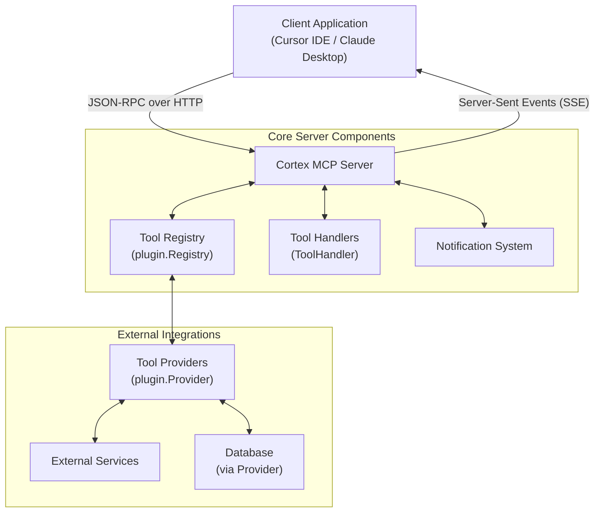
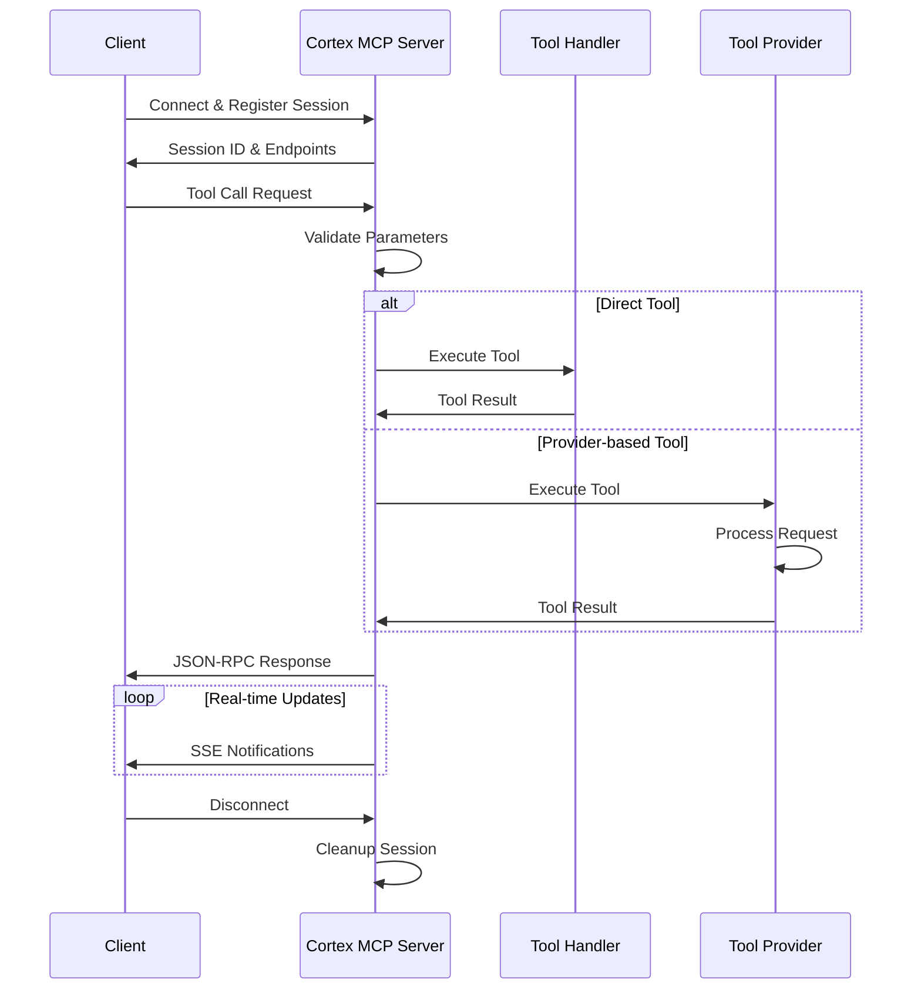
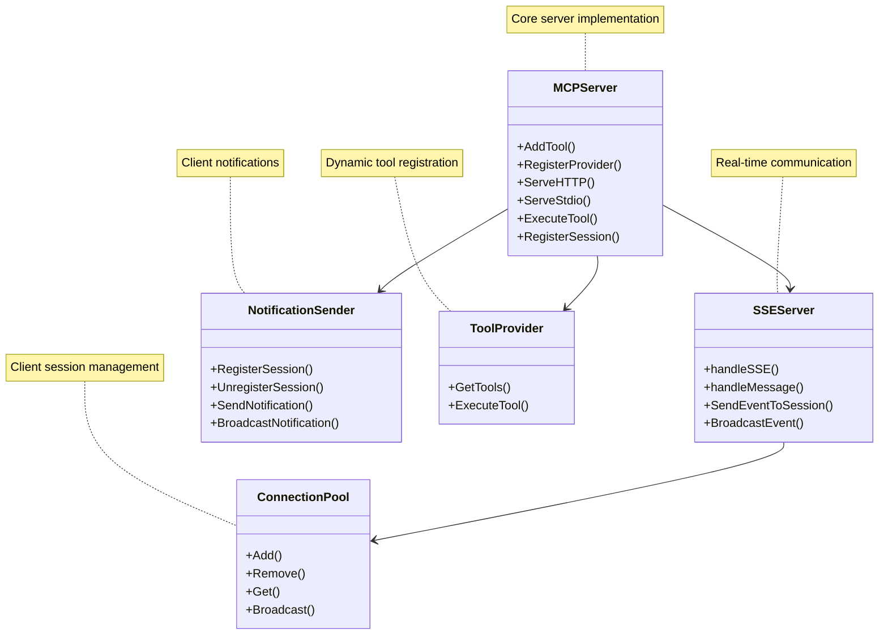

# Cortex MCP Server: Client Interaction Flow

This document describes how the Cortex MCP server interacts with client applications such as Cursor IDE and Claude Desktop.

## Architecture Overview



## Connection Establishment

1. **Client Initiates Connection**:
   - The client connects to the Cortex MCP server via HTTP
   - Supported transport protocols:
     * HTTP API (REST)
     * Server-Sent Events (SSE) for real-time updates
     * Standard I/O (for command-line integration)

2. **Session Registration**:
   - Server assigns a unique session ID to the client
   - Client's user agent is recorded
   - A notification channel is established for server-to-client communication

## Communication Protocol (JSON-RPC)

### Client-to-Server Communication

Clients send JSON-RPC messages to the server's message endpoint:

```json
{
  "jsonrpc": "2.0",
  "id": "request-123",
  "method": "tools/call",
  "params": {
    "name": "tool_name",
    "parameters": { /* tool-specific parameters */ }
  }
}
```

### Server-to-Client Communication

Server responds with JSON-RPC responses:

```json
{
  "jsonrpc": "2.0",
  "id": "request-123",
  "result": { /* tool-specific response */ }
}
```

For errors:

```json
{
  "jsonrpc": "2.0",
  "id": "request-123",
  "error": {
    "code": -32000,
    "message": "Error message"
  }
}
```

### Real-time Updates via SSE

- Server sends notifications using Server-Sent Events (SSE)
- Notifications follow JSON-RPC format but without an ID field
- Used for status updates, progress reports, etc.

## Tool Execution Flow



## Integration Modes

1. **Standalone Server**:
   - Server runs independently and listens on a port
   - Provides HTTP API and SSE endpoints

2. **Embedded Mode**:
   - Server is embedded within another application (e.g., PocketBase)
   - Uses HTTP adapter for integration with existing HTTP servers

3. **STDIO Mode**:
   - Server communicates via standard input/output
   - Useful for CLI tools and scripted interactions

## Key Components



This architecture enables clients like Cursor IDE or Claude Desktop to interact with tools and services provided by the Cortex server, maintaining persistent connections for real-time updates. 