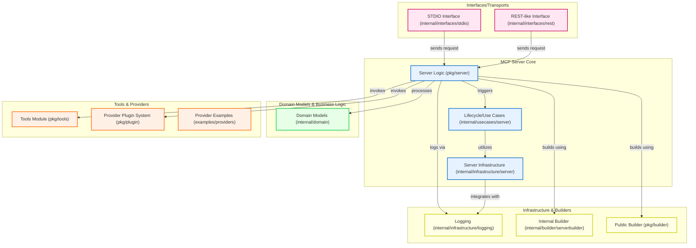

## Repository Diagram

```mermaid
flowchart TD
    %% Interfaces / Transports
    subgraph "Interfaces/Transports"
        STDIO["STDIO Interface (internal/interfaces/stdio)"]:::interface
        REST["REST-like Interface (internal/interfaces/rest)"]:::interface
    end

    %% MCP Server Core
    subgraph "MCP Server Core"
        SERVER["Server Logic (pkg/server)"]:::core
        LIFECYCLE["Lifecycle/Use Cases (internal/usecases/server)"]:::core
        INFRA_SERVER["Server Infrastructure (internal/infrastructure/server)"]:::core
    end

    %% Domain Models & Business Logic
    subgraph "Domain Models & Business Logic"
        DOMAIN["Domain Models (internal/domain)"]:::domain
    end

    %% Tools & Providers
    subgraph "Tools & Providers"
        TOOLS["Tools Module (pkg/tools)"]:::tools
        PLUGIN["Provider Plugin System (pkg/plugin)"]:::tools
        PROVIDER_EX["Provider Examples (examples/providers)"]:::tools
    end

    %% Infrastructure & Builders
    subgraph "Infrastructure & Builders"
        LOGGING["Logging (internal/infrastructure/logging)"]:::infra
        INTERNAL_BUILDER["Internal Builder (internal/builder/serverbuilder)"]:::infra
        PUBLIC_BUILDER["Public Builder (pkg/builder)"]:::infra
    end

    %% Connections from Interfaces to MCP Server Core
    STDIO -->|"sends request"| SERVER
    REST  -->|"sends request"| SERVER

    %% Internal Server Core flow
    SERVER -->|"triggers"| LIFECYCLE
    LIFECYCLE -->|"utilizes"| INFRA_SERVER

    %% MCP Server Core interactions with other components
    SERVER -->|"processes"| DOMAIN
    SERVER -->|"invokes"| TOOLS
    SERVER -->|"invokes"| PLUGIN
    SERVER -->|"logs via"| LOGGING
    SERVER -->|"builds using"| INTERNAL_BUILDER
    SERVER -->|"builds using"| PUBLIC_BUILDER

    %% Additional connection
    INFRA_SERVER -->|"integrates with"| LOGGING

    %% Click Events
    click SERVER "https://github.com/freepeak/cortex/blob/main/pkg/server/server.go"
    click LIFECYCLE "https://github.com/freepeak/cortex/blob/main/internal/usecases/server.go"
    click INFRA_SERVER "https://github.com/freepeak/cortex/tree/main/internal/infrastructure/server/"
    click STDIO "https://github.com/freepeak/cortex/tree/main/internal/interfaces/stdio/"
    click REST "https://github.com/freepeak/cortex/blob/main/internal/interfaces/rest/server.go"
    click DOMAIN "https://github.com/freepeak/cortex/tree/main/internal/domain/"
    click TOOLS "https://github.com/freepeak/cortex/blob/main/pkg/tools/helper.go"
    click PLUGIN "https://github.com/freepeak/cortex/tree/main/pkg/plugin/"
    click PROVIDER_EX "https://github.com/freepeak/cortex/tree/main/examples/providers/"
    click LOGGING "https://github.com/freepeak/cortex/tree/main/internal/infrastructure/logging/"
    click INTERNAL_BUILDER "https://github.com/freepeak/cortex/blob/main/internal/builder/serverbuilder.go"
    click PUBLIC_BUILDER "https://github.com/freepeak/cortex/tree/main/pkg/builder/"

    %% Styles
    classDef interface fill:#ffe6f2,stroke:#cc0066,stroke-width:2px;
    classDef core fill:#e6f2ff,stroke:#0066cc,stroke-width:2px;
    classDef domain fill:#e6ffe6,stroke:#00cc44,stroke-width:2px;
    classDef tools fill:#fff0e6,stroke:#ff6600,stroke-width:2px;
    classDef infra fill:#ffffe6,stroke:#cccc00,stroke-width:2px;
```
